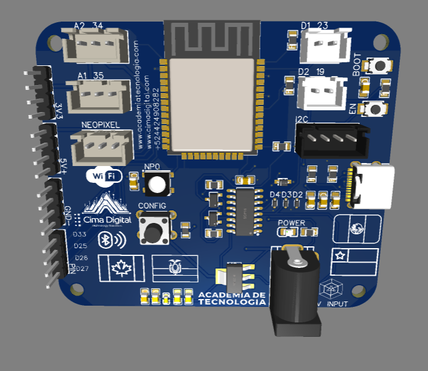
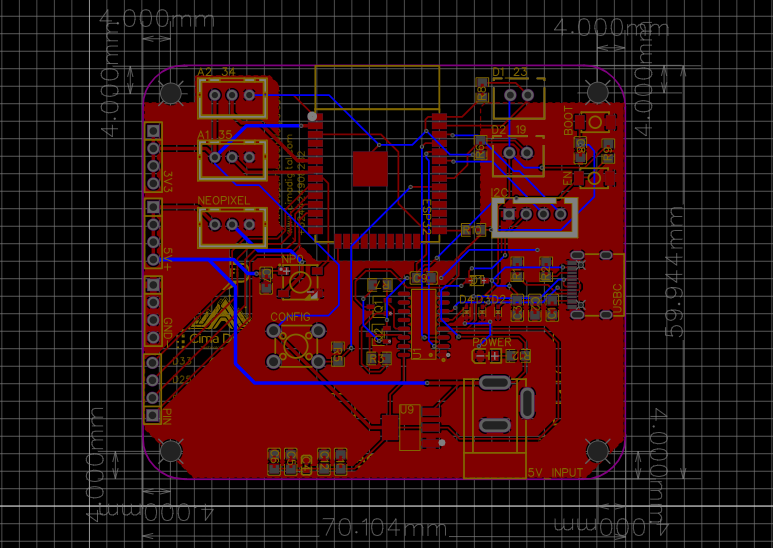

# LightControl ESP32 Firmware

Welcome to **LightControl ESP32 Firmware**! This repository contains the firmware for the ESP32 board, enabling **Bluetooth Low Energy (BLE)** communication with the [LightControl BLE Android app](https://github.com/AlexisZhuber/LightControlBleAndroid). Through this firmware, you can control LED colors, send patterns, and explore various lighting effects.

---

## Video Demonstration

Check out our **YouTube demo** for an overview of the firmware in action:  
[](https://www.youtube.com/watch?v=VYWe0CdZpbw)

---

## Images

### 3D Model


### Schematic


---

## Features

- **BLE Connectivity**: Communicates with the Android app via a secure, low-energy Bluetooth protocol.
- **LED Color Control**: Receives color commands (RGB/HSV) to update LED strips or matrices in real time.
- **Matrix Patterns**: Processes commands for individual LED cells, allowing dynamic animations or text displays.
- **Configurable Services**: Customizable UUIDs for BLE services and characteristics.
- **Robust Data Handling**: Manages incoming BLE messages to prevent packet loss and ensure stability.

---

## Requirements

- **ESP32 Development Board** (e.g., ESP32-WROOM or similar).
- **Arduino IDE** (1.8+) or **PlatformIO** (VSCode extension).
- **Libraries**:  
  - ESP32 Core for Arduino IDE or PlatformIO  
  - Any additional libraries for LED control (e.g., FastLED, Adafruit NeoPixel) depending on your setup.
- **Power Supply**: Ensure a stable 5V or 3.3V power source for LEDs if you are driving a significant number of them.

---

## Setup & Installation

1. **Clone this repository**:
   ```bash
   git clone https://github.com/AlexisZhuber/LightControl-ESP32-Firmware.git
